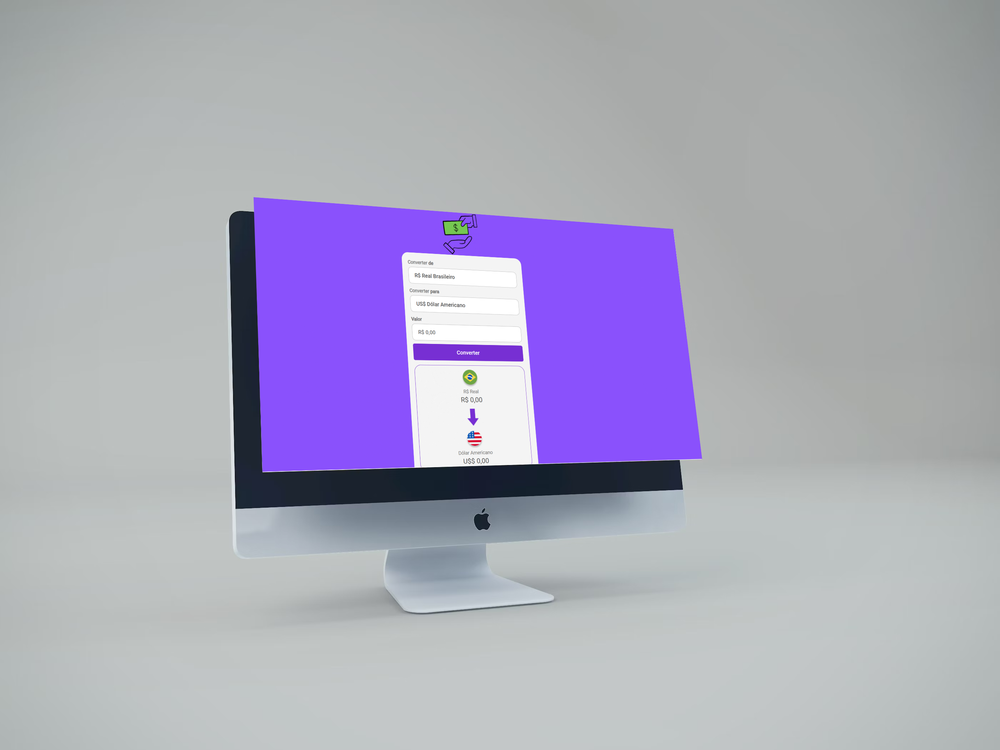
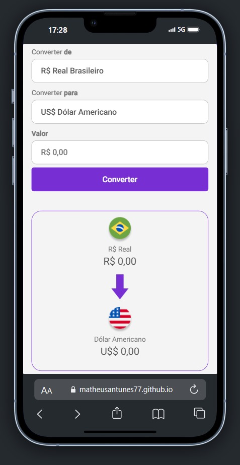

<h1>Conversor de Moedas - DevClub</h1>
 
<h2>Mais um projeto desenvolvido pela a plataforma de ensino <a href="https://rodolfomori.com.br/devclub/">DevClub</a></h2>
<h1>Sobre o projeto</h1>

Esse conversor foi desenvolvido com a linguagem de marcação de texto HTML e de estilização CSS e a linguagem de programação JavaScript.

<h1>Funcionalidades</h1>

Onde tem um imagem GIF para interatividade do usuário e depois o conversor pedindo a moeda que você está usufruindo e para a qual moeda você quer usar e o valor que você quer converter.

Tem as opções de moeda como Real, Euro, Libra , Dinar kwatiano.

<h1>Let's plan on your notebook and smartphone</h1>
<h2>DESKTOP</h2>

<h2>MOBILE</h2>

